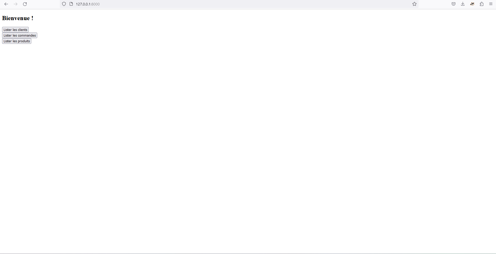
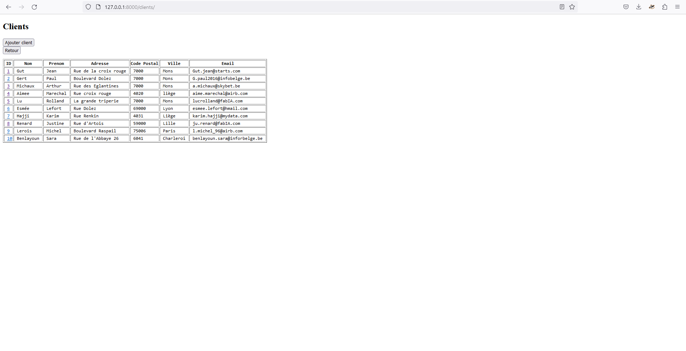
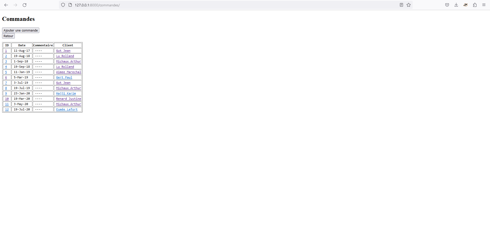
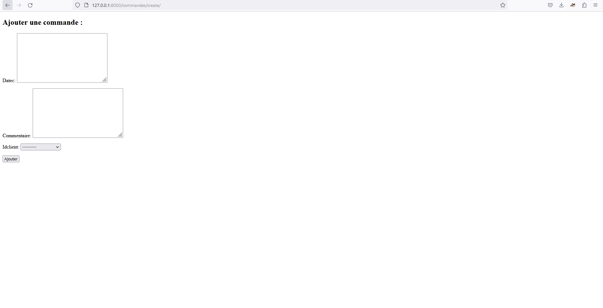
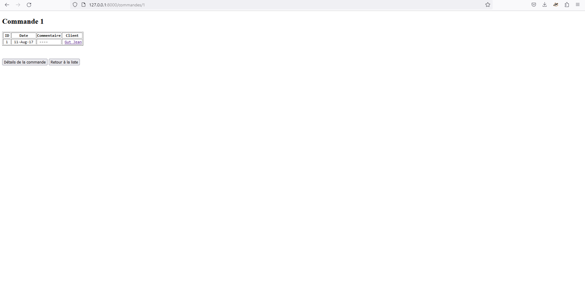
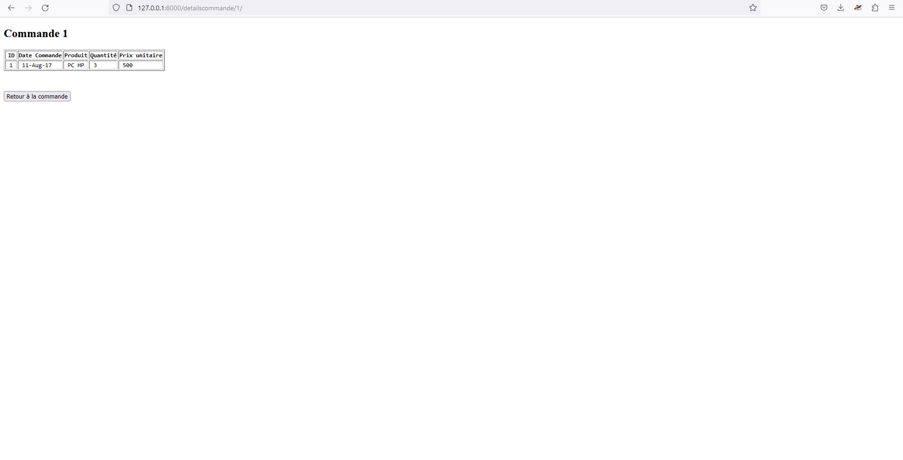
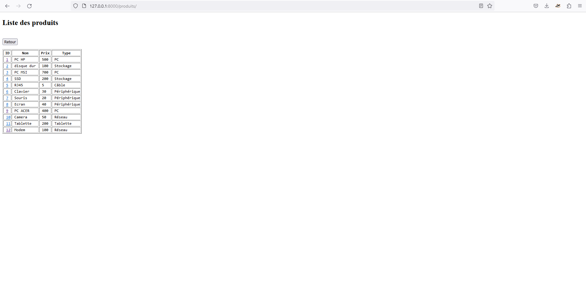
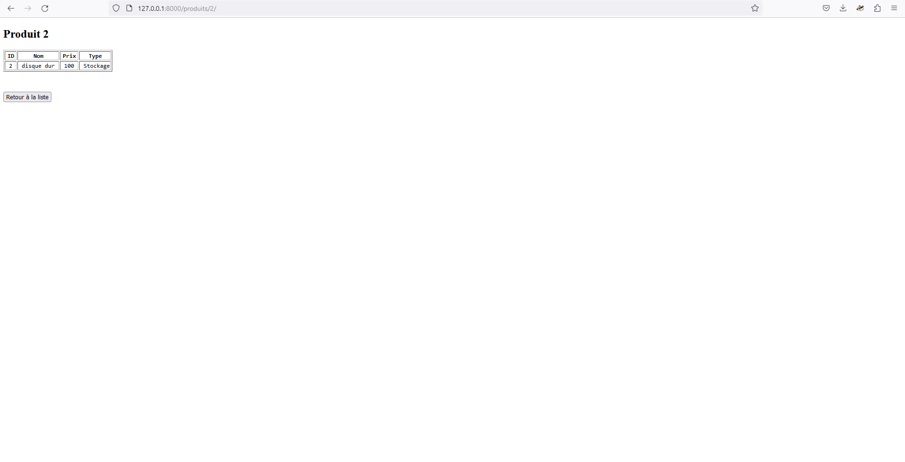

# I-ILIA-113-TP-7.3-Django
Introduction au framework Django

## Modifications

Les modifications apportées sont les suivantes :
- Chargement d'une DB existante
- Modification du modèle généré par l'ORM (ajout des foreign keys entre autres)
- Ajout d'un CRUD pour les commandes
- Ajout de vues et de contrôleurs
- Ajout d'une navigation entre données (on peut par exemple lister les commande, cliquer sur le nom du client de la commande pour voir ses détails, idem pour les détails de la commande et les produits)
- Ajout d'une homepage

## Captures d'écran 

